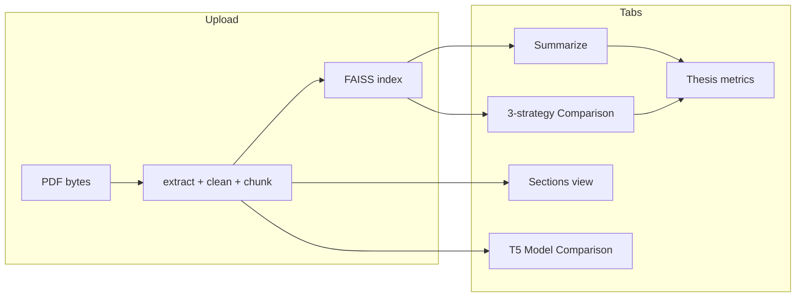

# App Overview

**Local AI Research Paper Summarizer** (`Rezumat_PDF`) is a single-process Python application with a Streamlit web UI. It extracts text from research PDFs, summarizes them locally using small pretrained language models, supports semantic question answering over document chunks, and includes thesis-oriented evaluation features (metrics, strategy comparison, optional T5 fine-tuning experiments).

There is **no separate backend server**, **no database**, and **no user authentication**. All inference runs on the user's machine.

---

## 1. What the App Does

The app helps researchers and students work with **text-based PDF research papers** without sending documents to a cloud API.

After uploading a PDF, the app:

1. Extracts plain text from the PDF (PyMuPDF).
2. Cleans and splits the text into overlapping chunks.
3. Detects common academic sections (Abstract, Introduction, etc.) using heading heuristics.
4. Builds a local semantic search index (embeddings + FAISS) over chunks.
5. Generates summaries (hierarchical DistilBART, or structured multi-section summaries via instruct models).
6. Answers questions by retrieving relevant chunks and generating a grounded response.
7. Runs comparison experiments for thesis work (three summarization strategies, or pretrained vs fine-tuned T5).

The project targets **modest hardware** (approximately 4 GB VRAM and 24 GB RAM). CPU inference is supported but slower. **Scanned/image-only PDFs without a text layer are not supported** (no OCR).

---

## 2. Main Features

The UI is organized into **five tabs** (defined in `app.py` via `st.tabs`).

| Tab | What it does |
|-----|----------------|
| **Summarize & Q&A** | Upload PDF (main uploader), generate summary, view metrics, export summary to TXT, ask questions with cited source chunks |
| **Detected sections** | Shows heuristic section splits (Abstract, Introduction, Methodology, Results, Conclusion) with previews |
| **Comparison** | Runs three DistilBART summarization strategies on the same paper for thesis experiments |
| **Model Comparison** | Compares pretrained `google-t5/t5-small` vs a local fine-tuned T5 checkpoint on the same PDF chunks |
| **Thesis metrics** | Aggregates latest summary metrics, Q&A metrics, comparison table, section stats, and runtime breakdown |

### Summarization modes

- **Short / detailed / bullet points** — hierarchical summarization with `sshleifer/distilbart-cnn-12-6`.
- **Detailed structured format** — multi-section output (Title/Topic, Main idea, Method, Results, etc.).
- **Section-aware structured summary** (recommended when structured mode is on) — separate FAISS retrieval query per field, generation via Qwen2.5-0.5B-Instruct or flan-t5-small fallback, duplicate detection across fields.

### Other capabilities

- **Semantic Q&A** — top-k chunk retrieval + summarization or instruct-model answer; sources shown with L2 distance scores.
- **Intrinsic evaluation** — word counts, compression ratio, runtime per operation.
- **Optional ROUGE** — in Model Comparison tab when user pastes a reference abstract; also in `training/evaluate_rouge.py`.
- **Optional T5 fine-tuning** — offline scripts under `training/` (not required to run the main app).

---

## 3. Tech Stack

| Category | Technology |
|----------|------------|
| **Language** | Python 3.x |
| **UI framework** | [Streamlit](https://streamlit.io/) (`streamlit>=1.28.0`) |
| **PDF extraction** | [PyMuPDF](https://pymupdf.readthedocs.io/) (`pymupdf`, import name `fitz`) |
| **Deep learning** | [PyTorch](https://pytorch.org/) (`torch>=2.0.0`) |
| **NLP models** | [Hugging Face Transformers](https://huggingface.co/docs/transformers) (`transformers>=4.37.0`, `accelerate`, `sentencepiece`) |
| **Embeddings** | [sentence-transformers](https://www.sbert.net/) (`all-MiniLM-L6-v2`) |
| **Vector search** | [FAISS](https://github.com/facebookresearch/faiss) CPU (`faiss-cpu`) |
| **Numerics** | `numpy` |
| **Evaluation** | `rouge-score` (ROUGE-1/2/L in app Model Comparison + training scripts) |
| **Training (optional)** | `datasets` 2.x, `Seq2SeqTrainer`, `tqdm` — see `training/requirements-training.txt` |

### Models loaded at runtime (Hugging Face Hub)

| Model ID | Role |
|----------|------|
| `sshleifer/distilbart-cnn-12-6` | Default chunk and hierarchical summarization |
| `sentence-transformers/all-MiniLM-L6-v2` | Chunk embeddings for FAISS |
| `Qwen/Qwen2.5-0.5B-Instruct` | Section-aware structured fields; optional Q&A |
| `google/flan-t5-small` | Fallback instruct model |
| `google-t5/t5-small` | Model Comparison tab (pretrained baseline) |
| Local checkpoint folder | Model Comparison tab (fine-tuned T5) |

### What this project does **not** use

- No React, Vue, or separate frontend build
- No Flask/FastAPI/Django REST API
- No SQL/NoSQL database
- No Docker or Kubernetes configuration in the repo
- No automated test suite in the repository
- No cloud LLM API keys (OpenAI, etc.) — inference is local

---

## 4. Project Structure

```
Rezumat_PDF/
├── app.py                      # Streamlit entry point (main UI)
├── requirements.txt            # Main app dependencies
├── README.md                   # User and thesis documentation
├── APP_OVERVIEW.md             # This file
│
├── src/                        # Application logic (imported by app.py)
│   ├── pdf_utils.py            # PDF → text extraction
│   ├── text_utils.py           # Cleaning and chunking
│   ├── summarizer.py           # DistilBART hierarchical summarization
│   ├── vector_store.py         # MiniLM embeddings + FAISS index
│   ├── qa_system.py            # Retrieve-then-answer Q&A
│   ├── section_detector.py     # Heuristic section headings
│   ├── structured_summary.py   # Per-field retrieval + instruct generation
│   ├── instruct_generator.py   # Qwen / FLAN wrappers
│   ├── comparison.py           # Three-strategy comparison runner
│   ├── evaluation.py           # Metrics, ROUGE, TXT export
│   └── model_manager.py        # T5 load/inference for Model Comparison tab
│
└── training/                   # Optional fine-tuning experiment (isolated)
    ├── train_t5_small.py       # Fine-tune T5-small on scientific_papers
    ├── evaluate_rouge.py       # ROUGE: pretrained vs fine-tuned
    ├── dataset_utils.py        # Dataset subset + tokenization
    ├── requirements-training.txt
    ├── README_training.md
    ├── checkpoints/            # Saved models (gitignored contents)
    └── results/                # ROUGE JSON output
```

**Entry point:** run `streamlit run app.py` from the project root. Python adds the project root to `sys.path` so `src` modules import as `from src.module import ...`.

---

## 5. App Flow

### Startup

1. User runs `streamlit run app.py`.
2. Streamlit executes `app.py` top-to-bottom on each interaction (rerun model).
3. `init_session_state()` ensures default keys exist in `st.session_state`.
4. Sidebar renders summarization and Q&A settings.
5. Models are **not** all loaded at startup; they load lazily via `@st.cache_resource` when first needed (`get_summarizer`, `get_embedder`, `get_instruct_generator`).

### PDF upload (main uploader)

1. User uploads a PDF via `st.file_uploader`.
2. File bytes are hashed (MD5); if the file changed, processing runs:
   - `extract_text_from_pdf()` → raw text + page count
   - `clean_text()` → normalized text
   - `chunk_text()` → list of overlapping character chunks
   - `detect_sections()` → `PaperSections`
   - `build_index()` → FAISS `VectorIndex` over chunks
3. Results stored in session state; summary/Q&A/comparison state reset for the new document.

### Tab interactions

Each tab reads from `st.session_state` and triggers Python functions on button clicks. There is **no URL-based routing** — navigation is Streamlit tabs only.



---

## 6. Core Components

### `app.py` — UI orchestration

- Streamlit layout: title, sidebar, file uploader, five tabs.
- Cached loaders for summarizer, embedder, instruct generator.
- Cached `process_pdf()` for extraction/chunking.
- Session state initialization and metric display helpers.
- Wires all `src/` modules to user actions.

### `src/pdf_utils.py`

- `extract_text_from_pdf(file_bytes)` — opens PDF with PyMuPDF, concatenates per-page text.
- Raises `ValueError` if PDF is empty or has no extractable text.

### `src/text_utils.py`

- `clean_text()` — removes hyphenation artifacts, normalizes whitespace, drops isolated page numbers.
- `chunk_text()` — fixed-size character windows with overlap (default 1200 chars, 150 overlap).

### `src/summarizer.py`

- Loads `sshleifer/distilbart-cnn-12-6`.
- `GenerationSettings` dataclass for beam search parameters.
- `summarize_text()` — single-pass abstractive summary.
- `hierarchical_summarize()` — summarize each chunk → merge combined summaries → final pass (or branch into structured modes).
- `get_device()` — `cuda` if available, else `cpu`.

### `src/vector_store.py`

- `VectorIndex` — wraps `faiss.IndexFlatL2` + chunk text list.
- `build_index()` — encodes all chunks with MiniLM, adds to FAISS.
- `search()` — returns top-k `(chunk_text, L2_distance)` pairs (lower distance = more similar).

### `src/section_detector.py`

- Regex/heuristic matching for headings: abstract, introduction, methodology, results, conclusion.
- `PaperSections` — `sections` dict, `detected` list, `coverage_ratio`, `fallback_body` flag.
- `intro_conclusion_fallback()` — first/last 20% of text when headings missing.

### `src/structured_summary.py`

- Nine structured fields with **unique retrieval queries** (`FIELD_RETRIEVAL_QUERIES`).
- Weak retrieval threshold (`WEAK_DISTANCE_THRESHOLD = 1.15`) → `MISSING_TEXT`.
- Duplicate detection via `difflib` (`DUPLICATE_RATIO_THRESHOLD = 0.75`) with retry/regeneration.
- Returns `StructuredSummaryResult` with formatted `body` and per-field `FieldResult` (optional sources).

### `src/instruct_generator.py`

- `InstructGenerator` — unified wrapper for Qwen (causal LM) or FLAN-T5 (seq2seq).
- Prompt templates for field generation, key takeaways, and Q&A.
- `load_instruct_model_with_fallback()` — tries Qwen, falls back to FLAN with warning string.

### `src/qa_system.py`

- `answer_question()` — embed query, FAISS search, build prompt, generate answer.
- Uses DistilBART or instruct model depending on `use_instruct_qa`.
- Prepends limitation notice when context is thin or retrieval scores are weak.

### `src/comparison.py`

- `run_comparison()` — sequentially runs three strategies:
  - `full` — hierarchical summary on first N chunks
  - `intro_conclusion` — summary of intro+conclusion sections (or fallback)
  - `retrieved_only` — summary of semantically retrieved chunks
- Returns `list[ComparisonResult]` via `evaluation.compare_summaries()`.

### `src/model_manager.py`

- Used **only** by the Model Comparison tab (T5 family).
- `load_pretrained_model()` / `load_finetuned_model()` with CUDA OOM → CPU fallback.
- `generate_summary_with_model()` — prefixes input with `"summarize: "` (T5 convention).
- `hierarchical_summarize_for_model()` — two-pass chunk → final summary (fair comparison: same chunks for both models).

### `src/evaluation.py`

- Intrinsic metrics: `SummaryMetrics`, `evaluate_summary()`, `compare_summaries()`.
- `word_count()`, `compression_ratio()`, `calculate_rouge()`, `approx_token_count()`.
- `format_summary_export()` — plain-text download for thesis appendix.
- `evaluate_qa()` — lightweight Q&A stats.

### `training/` (optional)

- **`dataset_utils.py`** — streams `scientific_papers` (arxiv/pubmed), tokenizes with T5 prefix.
- **`train_t5_small.py`** — `Seq2SeqTrainer` fine-tuning, saves to `training/checkpoints/t5-small-scientific/`.
- **`evaluate_rouge.py`** — compares pretrained vs checkpoint ROUGE on validation subset.

---

## 7. Backend / API Logic

This app has **no traditional backend**. There are no HTTP routes, controllers, or middleware.

| Concern | Implementation |
|---------|----------------|
| **Business logic** | Python modules under `src/`, called directly from `app.py` |
| **Persistence** | `st.session_state` only (in-memory for the browser session) |
| **External APIs** | Hugging Face Hub (`from_pretrained`) for downloading models on first use |
| **Database** | None |
| **Authentication** | None |

**Data flow pattern:** UI event → read session state → call `src` function → update session state → re-render widgets.

The only network dependency during normal use is **optional**: downloading pretrained weights from Hugging Face if not cached locally.

---

## 8. Frontend Logic

“Frontend” here means the **Streamlit UI** in `app.py` (Python, not HTML/JS components).

### Layout

- **Wide layout** (`layout="wide"`).
- **Sidebar** — summarization settings (summary type, structured options, chunk parameters, max chunks) and Q&A settings (answer length, top-k, instruct Q&A toggle).
- **Main area** — PDF uploader + tabbed content.

### State management

Streamlit reruns the script on each interaction. Persistent data lives in **`st.session_state`**:

| Key | Purpose |
|-----|---------|
| `raw_text`, `cleaned_text`, `chunks`, `page_count` | Processed PDF |
| `sections` | `PaperSections` from detector |
| `vector_index` | FAISS index |
| `summary`, `summary_metrics`, `structured_result` | Latest summary output |
| `comparison_results` | Three-strategy comparison |
| `model_comparison` | T5 side-by-side comparison results |
| `qa_answer`, `qa_sources`, `qa_metrics` | Q&A output |
| `last_runtime` | Timing dict for sidebar/debug |
| `file_hash`, `paper_name` | Upload tracking |

### Caching

- `@st.cache_resource` — expensive model loads (summarizer, embedder, instruct).
- `@st.cache_data` — `process_pdf()` keyed by file bytes + chunk settings.

### User inputs

- File uploaders (main PDF + separate PDF in Model Comparison tab).
- Selectboxes, sliders, checkboxes, text input/area, primary buttons.
- `st.download_button` for TXT export.
- `st.dataframe` / `st.metric` / `st.expander` for results display.

---

## 9. Data Models

The app uses **Python dataclasses** and dicts — not database tables or ORM models.

### `PaperSections` (`section_detector.py`)

| Field | Type | Meaning |
|-------|------|---------|
| `sections` | `dict[str, str]` | Section name → text |
| `detected` | `list[str]` | Which canonical sections were found |
| `coverage_ratio` | `float` | Fraction of document in named sections |
| `fallback_body` | `bool` | True if no headings matched |

### `VectorIndex` (`vector_store.py`)

| Field | Type | Meaning |
|-------|------|---------|
| `index` | `faiss.IndexFlatL2` | Embedding index |
| `chunks` | `list[str]` | Original chunk texts (parallel to index rows) |

### `GenerationSettings` (`summarizer.py`)

Controls `model.generate`: `max_length`, `min_length`, `max_new_tokens`, `num_beams`, `no_repeat_ngram_size`, `repetition_penalty`, `length_penalty`, `early_stopping`.

### `SummaryMetrics` / `ComparisonResult` (`evaluation.py`)

- `SummaryMetrics` — `strategy`, `source_words`, `summary_words`, `compression_ratio`, `compression_percent`, `runtime_seconds`.
- `ComparisonResult` — `strategy`, `summary`, `metrics`.

### `FieldResult` / `StructuredSummaryResult` (`structured_summary.py`)

- `FieldResult` — `field_name`, `text`, `sources` (list of dicts with `text` and `score`).
- `StructuredSummaryResult` — `body` (formatted markdown-like text), `fields`.

### `InstructGenerator` (`instruct_generator.py`)

- `model_id`, `backend` (`"qwen"` | `"flan"`), `tokenizer`, `model`, `device`.

### `ModelBundle` (`model_manager.py`)

- `tokenizer`, `model`, `device`, `source` (model name or path label).

### Session state

See table in Section 8. Initialized in `init_session_state()` in `app.py`.

---

## 10. Authentication and Authorization

**Not implemented.**

The app is designed as a **local, single-user** tool. There is no login, signup, session tokens, API keys in the UI, role-based access, or protected routes. Anyone who can run Streamlit on the machine can use the app.

---

## 11. Important Workflows

### Workflow A: PDF upload and indexing

1. User selects PDF in main file uploader.
2. `process_pdf(file_bytes, chunk_size, overlap)` runs (cached).
3. `detect_sections(cleaned)` builds `PaperSections`.
4. `build_index(chunks, embed_model)` creates FAISS index.
5. Session state updated; success message shows page/chunk/section counts.

**Failure cases:** empty PDF, scanned PDF without text layer → `ValueError` shown via `st.error`.

---

### Workflow B: Generate summary (default hierarchical)

1. User clicks **Generate summary** (Summarize & Q&A tab).
2. `get_summarizer()` loads DistilBART (cached).
3. `hierarchical_summarize(chunks, ...)` runs:
   - Select `chunks[:max_chunks]`
   - Summarize each chunk (intermediate settings)
   - Merge chunk summaries (`_merge_combined_summaries`)
   - Final summarize with user preset (short/detailed/bullets)

```279:320:src/summarizer.py
    selected = chunks[:max_chunks]
    chunk_summaries: list[str] = []

    for chunk in selected:
        summary = summarize_text(
            chunk,
            tokenizer,
            model,
            device,
            settings=intermediate_settings,
        )
        if summary:
            chunk_summaries.append(summary)
    # ... merge combined, then final summarize_text or structured branch
```

4. `evaluate_summary()` computes metrics; results stored in session state.

---

### Workflow C: Section-aware structured summary

**When:** “Detailed structured format” + “Use section-aware structured summary” enabled.

1. Loads instruct model (Qwen with FLAN fallback).
2. `generate_structured_summary(vector_index, embed_model, instruct_generator, top_k)`:
   - For each of 9 fields: unique FAISS query → retrieve top-k → generate field text.
   - Skip weak retrieval → `"Not clearly specified in the document."`
   - Resolve duplicate fields (>75% similarity).
3. Returns `(body, StructuredSummaryResult)`; optional per-field sources in UI.

**Note:** Does not use DistilBART hierarchical passes for the main body; it uses retrieval + instruct generation per field.

---

### Workflow D: Question answering

1. User enters question, clicks **Get answer**.
2. `answer_question()` searches FAISS with the question as query.
3. Top-k chunks concatenated as context.
4. Answer generated via instruct model or DistilBART + `QA_PROMPT`.
5. Sources listed with L2 distances in expander.

---

### Workflow E: Three-strategy comparison (thesis)

1. User clicks **Run comparison** (Comparison tab).
2. `run_comparison()` executes `full`, then `intro_conclusion`, then `retrieved_only` (each calls hierarchical DistilBART).
3. Metrics computed per strategy; results in `st.session_state.comparison_results`.

**Cost:** three full summarization runs — can take several minutes on CPU.

---

### Workflow F: Pretrained vs fine-tuned T5 comparison

1. User uploads PDF in Model Comparison tab (or uses path from separate uploader).
2. Text extracted, chunked; `selected_chunks = chunks[:max_chunks]`.
3. Load pretrained T5 (`google-t5/t5-small`); `hierarchical_summarize_for_model(selected_chunks, ...)`.
4. Load fine-tuned checkpoint from local path; same chunks, same generation settings.
5. Metrics table built (words, compression, time, tokens); optional ROUGE if reference text provided.

**Fairness:** both models see identical `selected_chunks`. T5 inputs use prefix `"summarize: "`.

---

### Workflow G: Optional T5 fine-tuning (offline)

1. `pip install -r training/requirements-training.txt`
2. `python training/train_t5_small.py` — fine-tunes on `scientific_papers` subset.
3. Checkpoint saved to `training/checkpoints/t5-small-scientific/final/`
4. `python training/evaluate_rouge.py --checkpoint <path>` — ROUGE evaluation.

This does not modify the main app unless the user points Model Comparison at the saved checkpoint.

---

## 12. Configuration and Environment Variables

### Environment variables

The repository does **not** include a `.env` file. Optional environment variables:

| Variable | Purpose |
|----------|---------|
| `HF_HOME` | Hugging Face cache directory for downloaded models (documented in README) |
| CUDA-related vars | Standard PyTorch/CUDA environment (not app-specific) |

Device selection is automatic in code:

```python
# src/summarizer.py
return "cuda" if torch.cuda.is_available() else "cpu"
```

`model_manager.py` catches `torch.cuda.OutOfMemoryError` and retries on CPU.

### User-facing configuration (Streamlit sidebar)

| Setting | Default (approx.) | Module affected |
|---------|-------------------|-----------------|
| Summary type | short | `summarizer` presets |
| Max/min summary tokens | preset-dependent | `GenerationSettings` |
| Chunk size / overlap | 1200 / 150 | `text_utils.chunk_text` |
| Max chunks to summarize | 12 | All summarization paths |
| Structured / section-aware toggles | on for detailed | `structured_summary` |
| Q&A top-k | 5 | `qa_system`, `comparison` retrieval |
| Model Comparison: max new tokens | 128 | `model_manager` |
| Fine-tuned path | `training/checkpoints/t5-small-scientific/final` | `model_manager` |

### Config files

| File | Role |
|------|------|
| `requirements.txt` | Main app Python dependencies |
| `training/requirements-training.txt` | Isolated training dependencies (`datasets<3`) |
| `training/.gitignore` | Ignores checkpoint weights inside `checkpoints/` |

No `config.yaml`, `settings.json`, or Streamlit secrets file is present in the repo.

---

## 13. How to Run the App

### Prerequisites

- Python 3.10+ recommended (3.12 used in development)
- Enough disk space for Hugging Face model cache (~1 GB+ on first run)
- Optional: NVIDIA GPU with CUDA for faster inference

### Install and run (main app)

```bash
cd Rezumat_PDF
python -m venv venv

# Windows
venv\Scripts\activate

# macOS/Linux
# source venv/bin/activate

pip install -r requirements.txt
streamlit run app.py
```

Open the URL printed in the terminal (typically `http://localhost:8501`).

### Optional: fine-tuning experiment

```bash
pip install -r training/requirements-training.txt
python training/train_t5_small.py --train-size 1000 --val-size 100 --epochs 3
python training/evaluate_rouge.py --checkpoint training/checkpoints/t5-small-scientific/final
```

### Production build

There is **no production build step**. Streamlit is the deployment surface. For a shared deployment, you would run Streamlit (or wrap it) on a server — that is outside the current repository scope.

### Tests

**No test files** (`test_*.py`, `pytest`, etc.) were found in the repository. Verification is manual via the UI and optional training scripts.

---

## 14. Known Limitations / TODOs

### Functional limitations

| Limitation | Detail |
|------------|--------|
| **No OCR** | Scanned PDFs without a text layer fail at extraction |
| **Heuristic sections** | Non-standard paper layouts may not split correctly |
| **Domain mismatch** | DistilBART is trained on news (CNN/DailyMail), not scientific prose |
| **Q&A is not RAG+LLM chat** | Answers are abstractive summaries of retrieved chunks, not verified reasoning |
| **Long papers capped** | `max_chunks` limits how much text is summarized |
| **Comparison cost** | Three-strategy mode triples summarization time |
| **Model Comparison memory** | Loading two T5 models can be heavy on 4 GB VRAM |
| **Structured mode speed** | Nine retrieval + generation calls per summary (slowest path) |

### Documentation inconsistencies

- `training/README_training.md` states fine-tuned checkpoints are “not loaded by the app” — the **Model Comparison** tab in `app.py` **does** load local fine-tuned checkpoints via `src/model_manager.py`. The training folder remains optional for the main Summarize flow (still DistilBART-centric).

### Code TODOs

No `TODO` / `FIXME` comments were found in the Python source during documentation review. Future improvements are described narratively in `README.md` (OCR, deeper ROUGE benchmarks, integrating fine-tuned T5 into default summarization).

### Error handling gaps

- Broad `except Exception` in several UI blocks shows generic error messages.
- No retry logic for Hugging Face download failures beyond model-load `RuntimeError` messages.
- Model Comparison continues with pretrained-only if fine-tuned path is invalid (by design).

---

## 15. Developer Notes

### Where to change behavior

| Goal | Start here |
|------|------------|
| Change default summarizer model | `MODEL_NAME` in `src/summarizer.py` |
| Tune generation length/quality | `SUMMARY_PRESETS`, `GenerationSettings` in `src/summarizer.py` |
| Change embedding / search | `EMBEDDING_MODEL_NAME` in `src/vector_store.py` |
| Add structured field | `STRUCTURED_SECTIONS` + `FIELD_RETRIEVAL_QUERIES` in `src/structured_summary.py` |
| Swap instruct model | `QWEN_MODEL`, `FLAN_MODEL` in `src/instruct_generator.py` |
| T5 comparison defaults | `DEFAULT_PRETRAINED_MODEL`, `T5_PREFIX` in `src/model_manager.py` |
| New UI tab | Add to `st.tabs(...)` and new `with tab_...:` block in `app.py` |
| New metrics | Extend `src/evaluation.py`, wire in `app.py` |

### Streamlit caching

If you change model-loading code, clear cache during development:

- Restart Streamlit, or
- Use Streamlit’s “Clear cache” from the menu, or
- Change function signatures/arguments passed to `@st.cache_resource` / `@st.cache_data`.

### Fair model comparison (T5)

- Always use the **same chunk list** for both models (`chunks[:max_chunks]`).
- Keep the **`summarize: `** prefix for T5 inputs (`model_manager.T5_PREFIX`).
- Use identical `generation_config` for chunk and final passes.

### Dependency isolation

- Main app: `requirements.txt`
- Training: `training/requirements-training.txt` (pins `datasets<3` for `scientific_papers` script)

Do not merge training pins into the main requirements unless you intend to support dataset scripts in the app.

### Adding authentication or a REST API

Would require **new architecture** (not present today): e.g. FastAPI backend + separate frontend, or Streamlit-Authenticator. Current codebase is intentionally single-process and local.

### Thesis / evaluation tips

- Use **Comparison** tab for three-strategy tables in the thesis.
- Use **Model Comparison** for pretrained vs fine-tuned T5 on the same PDF with optional reference abstract for ROUGE.
- Export summaries via **Export summary to TXT** for appendix material.
- Record runtimes from **Thesis metrics** tab (`last_runtime` dict).

---

## Quick reference: command cheat sheet

```bash
# Main app
pip install -r requirements.txt
streamlit run app.py

# Optional training
pip install -r training/requirements-training.txt
python training/train_t5_small.py
python training/evaluate_rouge.py --checkpoint training/checkpoints/t5-small-scientific/final

# Optional: relocate Hugging Face cache
# set HF_HOME=C:\path\to\hf_cache    # Windows
# export HF_HOME=/path/to/hf_cache   # Linux/macOS
```

For user-facing setup and thesis framing, see [README.md](README.md). For the T5 fine-tuning experiment only, see [training/README_training.md](training/README_training.md).
